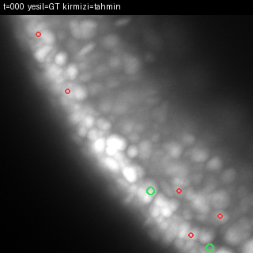

<h1 align="center">Biohub — Cell Tracking During Development</h1>

<p align="center">
  Detecting and tracking cell nuclei — including divisions — through 3D+time light-sheet microscopy of developing embryos.<br/>
  <a href="https://www.kaggle.com/competitions/biohub-cell-tracking-during-development">Kaggle competition</a> ·
  <a href="STATE.md">full engineering journal</a> ·
  <a href="#türkçe">Türkçe</a>
</p>

<p align="center">
  
</p>
<p align="center"><sub>Green = ground truth · Red = model prediction, animated over ~60 frames of a real training volume (max-intensity Z-projection).</sub></p>

<p align="center"><b>Final validated result: LB 0.863</b> (public leaderboard, embryo-disjoint hidden test set)</p>

---

## The task

- 3D+time volumes (`(T, Z, Y, X)`, physical voxel scale `1.625 × 0.40625 × 0.40625 µm`), sparse ground truth (~3.6% of true cells annotated).
- Train/test split is **embryo-disjoint**: all 199 training datasets come from 2 known embryo colonies; the hidden test set is entirely different embryos. This one fact drove most of the interesting engineering decisions below.
- The official metric (`adj_edge_jaccard + 0.1·division_jaccard`, verified byte-for-byte against the [official scorer](https://github.com/royerlab/kaggle-cell-tracking-competition)) is **not F1** — optimizing node F1 can actively lower the score.

## Pipeline

1. **Detector** — a 3D ConvNeXt-style U-Net (`UNet4D_SOTA_V9`) trained with a masked CenterNet-style loss that explicitly *ignores* unannotated-but-bright voxels instead of treating them as background. This single fix produced the biggest real, hidden-test-validated gain in the whole project (adj +0.0449 → LB 0.786, later 0.863 after tuning).
2. **Candidate generation** — GPU-side peak detection (`max_pool3d`) + single-pass greedy NMS, with density-adaptive per-frame node-count targeting (the hidden test has no ground truth to calibrate against directly).
3. **Linking** — greedy mutual-nearest-neighbor with a physically-scaled distance gate, plus physical-space gap closing for short detection dropouts.
4. **Hack auditor** — every submission is scanned (`drive/audit_submission.py`) for the known exploit patterns (hub nodes, out-of-volume coordinates, cross-clip edges) before it's ever written to disk.
5. **Kaggle driver** — a dependency-free CLI (`drive/kdrive.py`) for push / status / wait / log / leaderboard, so a full experiment cycle never requires touching the Kaggle web UI.

## What worked — and, more usefully, what didn't

The metric's theoretical ceiling is ~1.20; the score plateaued around 0.863 despite several methods that looked like clear wins in local validation. The most valuable finding of this project is *why* they didn't generalize:

| Attempt | Local signal | Real hidden-test result |
|---|---|---|
| Detector loss fix (ignore-mask for sparse GT) | adj +0.0449 | **held** — 0.786 → 0.863 |
| Learned edge classifier (geometric features, K-NN=16) | +0.0094 core, both folds up | **regressed** −0.004 |
| LAP (Hungarian) linking, tight gate | +0.0097 core, both folds up | **regressed** −0.004, same magnitude |
| LAP re-swept across the full gate range (5.5→12 µm) | monotonically worse as the gate widens — no safe middle ground | never shipped, ruled out analytically |
| Isotropic-pooling architecture fix (physically motivated, *not* tuned on local data) | training-internal proxy +0.06 | **regressed** end-to-end (root cause: Z-axis peak-splitting) |
| Division detection — 3 independent redesigns | went from 0/99 → 63/99 recoverable candidates after fixing a linker-dependency bug, then fixed a severe class-imbalance bug | still ~0 true positives at every threshold — closed, unsolved |

The pattern in the first three rows is the real lesson of this project: **anything calibrated only against the 2 known training embryos — learned weights or a hand-picked hyperparameter, it doesn't matter which — has no guarantee of surviving contact with a genuinely new embryo.** A wide, physically-loose linking gate generalized; a narrow one that scored better locally did not. Every attempt after the initial detector fix is written up in full, including the failures, in [`STATE.md`](STATE.md) — the failures turned out more informative than the one success.

## Repo layout

```
STATE.md                             full engineering journal (numbered steps, every measurement)
v11_00_probe.py                      metric verification against the official scorer
v11_01*.py, v11_02*.py               candidate generation + post-processing sweeps
v11_03*.py                           linker diagnostics, official-scorer cross-check
v11_05*.py                           detector training (incl. the sparse-GT loss fix, seed2 for ensembling)
v11_06*.py                           learned edge classifier experiments
v11_07*.py, v11_08*.py, v11_23*.py    division detection — geometric, then two learned redesigns
v11_09*.py                           LAP/Hungarian linking + gate sweeps
v11_10*.py, v11_11*.py               ensemble (2-seed) experiments
v11_12*.py – v11_14*.py              UNet-embedding-based edge features
v11_15*.py – v11_21*.py              isotropic-pooling architecture fix + failure diagnosis
v11_18*.py, v11_19*.py               targeted "is this actually a bug" audits
v11_27_gif_demo.py                   renders the GIF above
v11_S1_submit.py                     production submission script (self-contained, offline zarr reader, hack-audited)
drive/kdrive.py                      stdlib-only Kaggle API driver (push/status/wait/log/subs)
drive/audit_submission.py            standalone hack/exploit auditor
```

Scripts are numbered in the order the ideas were tried, not as a clean pipeline — this is a research log, not a package. `v11_S1_submit.py` is the one file that matters for reproducing the final score.

## Stack

PyTorch (3D ConvNeXt U-Net, mixed precision) · NumPy/SciPy (`cKDTree`-based linking and NMS) · scikit-learn (`HistGradientBoostingClassifier` for the learned-linking experiments) · [tracksdata](https://github.com/royerlab/kaggle-cell-tracking-competition) for official-metric cross-validation.

---

<a id="türkçe"></a>
## Türkçe

Kaggle'ın [Biohub Cell Tracking During Development](https://www.kaggle.com/competitions/biohub-cell-tracking-during-development) yarışması için çözümüm: gelişmekte olan embriyoların 3B+zaman ışık-sayfası (light-sheet) mikroskopi görüntülerinde hücre çekirdeklerini tespit edip zaman içinde takip etmek — bölünmeler dahil.

**Son doğrulanmış sonuç: LB 0.863** (herkese açık liderlik tablosu, embriyo-ayrık gizli test seti). Her ölçümün, her başarısızlığın ve kök-neden analizinin bulunduğu tam mühendislik günlüğü [`STATE.md`](STATE.md) dosyasında.

### Görev

- 3B+zaman hacimleri (`(T, Z, Y, X)`, fiziksel voxel ölçeği `1.625 × 0.40625 × 0.40625 µm`), seyrek ground truth (gerçek hücrelerin ~%3.6'sı işaretli).
- Eğitim/test ayrımı **embriyo-ayrık**: 199 eğitim dataset'inin tamamı 2 bilinen embriyo kolonisinden geliyor; gizli test seti tamamen farklı embriyolardan oluşuyor. Aşağıdaki mühendislik kararlarının çoğunu bu tek gerçek şekillendirdi.
- Resmi metrik (`adj_edge_jaccard + 0.1·division_jaccard`, [resmi skorlayıcıya](https://github.com/royerlab/kaggle-cell-tracking-competition) karşı bayt bayt doğrulandı) **F1 değil** — node F1'ini artırmaya çalışmak skoru aktif olarak düşürebiliyor.

### Boru hattı

1. **Detektör** — seyrek ama parlak (henüz işaretlenmemiş) voxelleri arka plan saymak yerine açıkça *yok sayan* maskeli bir CenterNet-tarzı kayıp fonksiyonuyla eğitilen 3B ConvNeXt-tarzı U-Net (`UNet4D_SOTA_V9`). Bu tek düzeltme, projenin gerçek, gizli-testte doğrulanmış en büyük kazancını sağladı (adj +0.0449 → LB 0.786, sonraki ince ayarla 0.863).
2. **Aday üretimi** — GPU tarafında tepe-noktası tespiti (`max_pool3d`) + tek geçişli açgözlü NMS, frame başına yoğunluğa uyarlanmış node hedefleme (gizli testte kalibrasyon için ground truth yok).
3. **Bağlama (linking)** — fiziksel ölçekli mesafe kapısıyla açgözlü karşılıklı-en-yakın-komşu, kısa tespit kesintileri için fiziksel-uzayda boşluk kapatma.
4. **Hack denetçisi** — her submission, diske yazılmadan önce bilinen istismar örüntüleri (hub node'lar, hacim-dışı koordinatlar, klip-arası kenarlar) için taranıyor (`drive/audit_submission.py`).
5. **Kaggle sürücüsü** — bağımlılıksız (`drive/kdrive.py`) push/durum/bekleme/log/skor komut satırı aracı; tam bir deney döngüsü Kaggle web arayüzüne hiç dokunmadan yürütülebiliyor.

### Ne işe yaradı — ve daha öğretici olanı, ne işe yaramadı

Metriğin teorik tavanı ~1.20; skor 0.863 civarında platoya girdi — üstelik yerel doğrulamada net kazanç gibi görünen birkaç yönteme rağmen. Bu projenin en değerli bulgusu, bunların *neden* genellemediği:

| Deneme | Yerel sinyal | Gerçek gizli-test sonucu |
|---|---|---|
| Detektör kayıp düzeltmesi (seyrek GT için yok-sayma maskesi) | adj +0.0449 | **tuttu** — 0.786 → 0.863 |
| Öğrenilen kenar sınıflandırıcısı (geometrik özellikler, K-NN=16) | +0.0094 core, iki fold da yukarı | **-0.004 regresyon** |
| LAP (Macar algoritması) bağlama, sıkı kapı | +0.0097 core, iki fold da yukarı | **-0.004 regresyon**, aynı büyüklükte |
| LAP, tüm kapı aralığında (5.5→12 µm) yeniden tarandı | kapı genişledikçe monotonik kötüleşme — güvenli bir orta yol yok | hiç gönderilmedi, analitik olarak elendi |
| İzotropik havuzlama mimari düzeltmesi (fiziksel gerekçeli, yerel veride ayarlanmamış) | eğitim-içi proxy +0.06 | gerçek uçtan-uca pipeline'da **regresyon** (kök neden: Z ekseninde tepe-noktası bölünmesi) |
| Bölünme tespiti — 3 bağımsız yeniden tasarım | linker-bağımlılığı hatası düzeltilince 0/99 → 63/99 kurtarılabilir aday, sonra ciddi bir sınıf-dengesizliği hatası da düzeltildi | her eşikte hâlâ ~0 doğru tespit — kapatıldı, çözülemedi |

İlk üç satırdaki örüntü projenin asıl dersi: **sadece bilinen 2 embriyoda kalibre edilmiş herhangi bir şey — öğrenilmiş ağırlık olsun, elle seçilmiş bir hiperparametre olsun, fark etmez — gerçekten yeni bir embriyoyla karşılaşınca tutacağının hiçbir garantisi yok.** Geniş, fiziksel olarak gevşek bir bağlama kapısı genelledi; yerelde daha iyi skor veren dar bir kapı genellemedi. İlk detektör düzeltmesinden sonraki her deneme — başarısız olanlar dahil — [`STATE.md`](STATE.md) içinde ayrıntılı olarak yazılı; çünkü başarısızlıklar tek başarıdan daha bilgilendirici çıktı.

### Depo düzeni ve teknoloji yığını

Yukarıdaki İngilizce bölümlerdeki "Repo layout" ve "Stack" başlıklarıyla aynı — script'ler fikirlerin denendiği sırayla numaralanmış (temiz bir pipeline sırasıyla değil), bu bir araştırma günlüğü, paket değil. `v11_S1_submit.py`, son skoru yeniden üretmek için önemli olan tek dosya.
